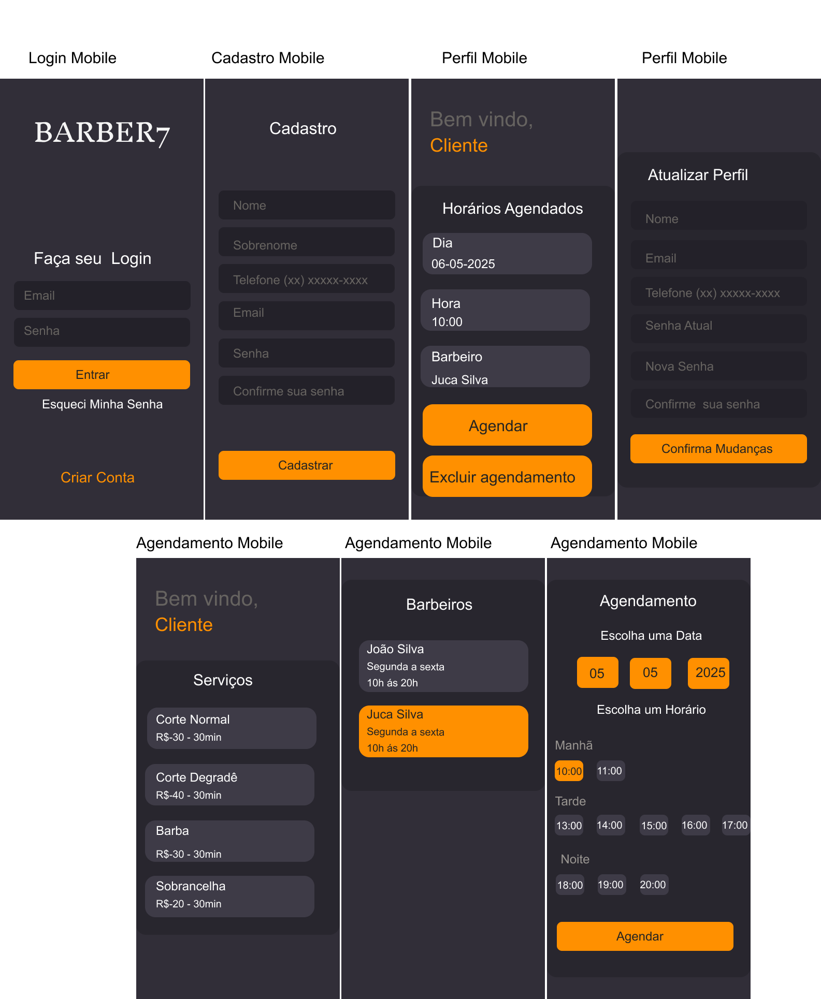
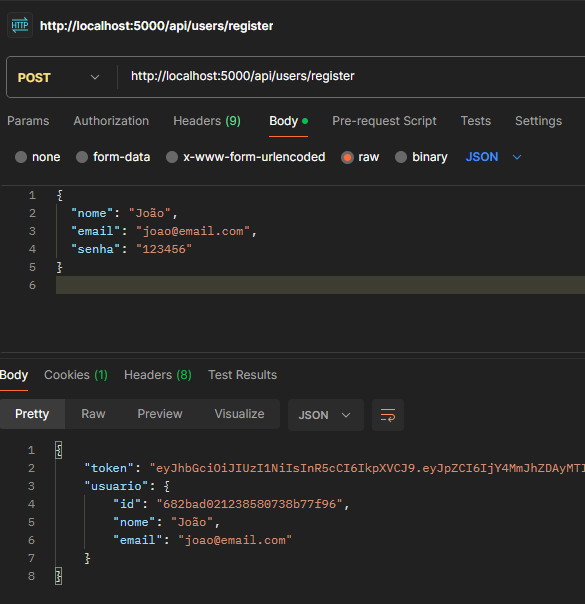
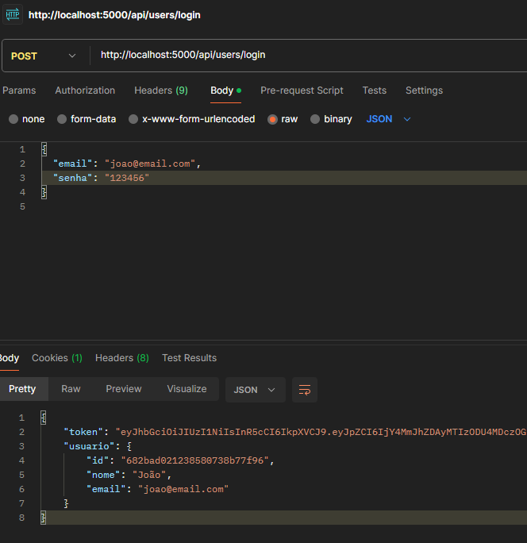
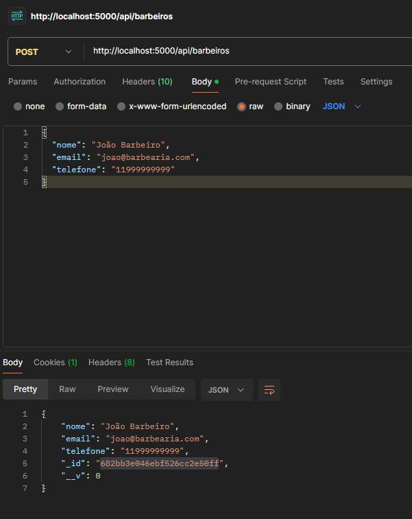
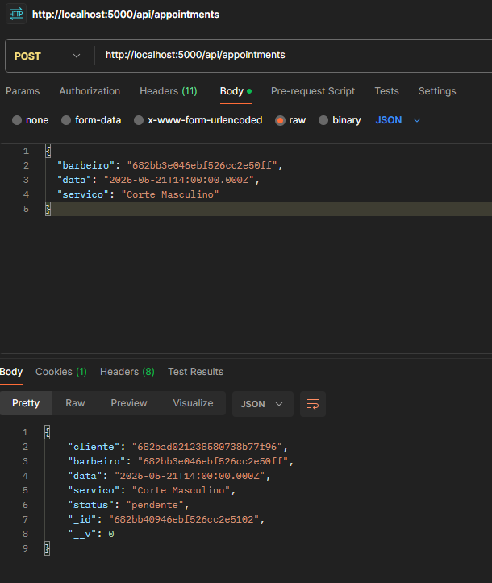
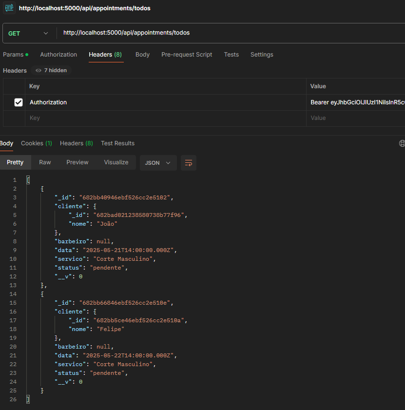
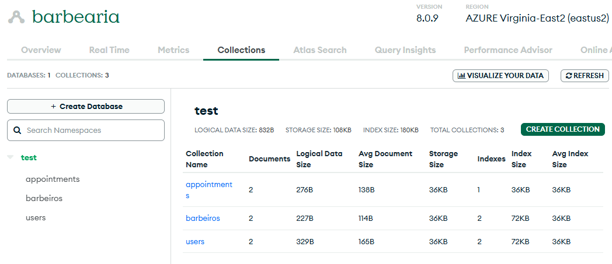
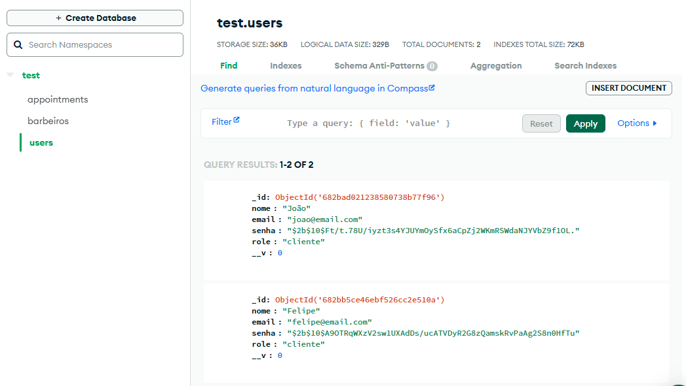
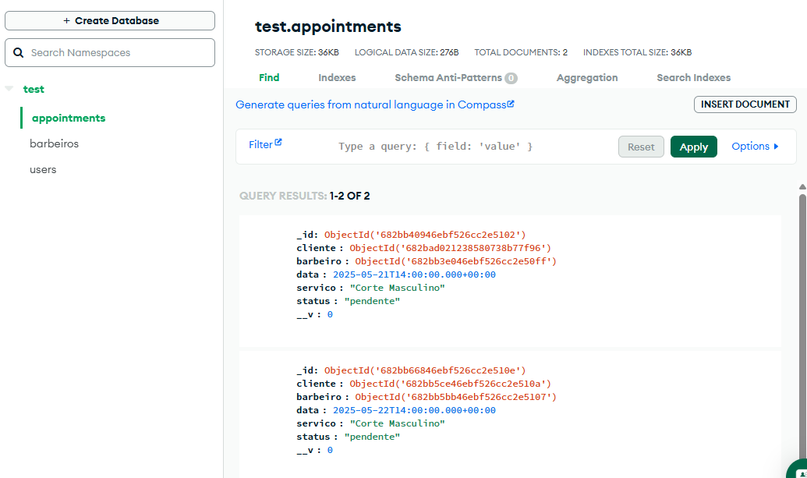

# Projeto Integrador - Desenvolvimento de Sistemas Orientado a Dispositivo Móveis Baseado na Web.

# Plataforma de Agendamento para Barbearias

## 📌 Visão Geral do Projeto

A plataforma digital de agendamento será desenvolvida com o objetivo de otimizar o processo de marcação de horários em barbearias. Pensando na fidelização dos clientes e na gestão eficiente dos serviços, criamos uma solução **exclusiva para cada barbearia**, acessível via QR Code em versão **web e mobile**.

Essa solução permite ao cliente agendar cortes, barbas e outros serviços com autonomia, evitando ligações e filas. Por outro lado, os administradores têm total controle sobre a agenda dos barbeiros, podendo promover horários ociosos e melhorar a comunicação com os clientes.

## 👥 Integrantes do Projeto

- Estevão Menezes Martin Moraes
- Fernanda Tomita Manchon
- Marcus Vinicius Raduan Boriola
- Rayane Souza
- Rodrigo de Pinho

## Preparação do Ambiente de Desenvolvimento

### 🎨 Layout no Figma
#### WEB


### MOBILE



### 💻 Frontend 
- Angular

### Backend
- [Java 17+](https://adoptium.net/)
- [Spring Boot 3](https://spring.io/projects/spring-boot)
- [Spring Data MongoDB](https://spring.io/projects/spring-data-mongodb)
- [JWT (JSON Web Token)](https://jwt.io/) para autenticação
- [Maven](https://maven.apache.org/) para gerenciamento de dependências

### Banco de dados
- [MongoDB Atlas](https://www.mongodb.com/cloud/atlas) — cluster gratuito na nuvem


### Utilitários
- Protótipo – Figma
- Editor -Visual Studio Code

---

## 🧠 Estrutura básica do projeto

```
src/
 ├── app/
 ├── frontend/
 └── test/
```

---

## 🧪 Evidências de Testes dos Endpoints (Postman)

### Cadastrar usuário


### Login


### Cadastro barbeiro


### Criar Agendamento


### Listar Todos os Agendamentos



## 🧪 Evidências dos dados no MongoDB

### Banco de dados


### Usuários


### Agendamentos

