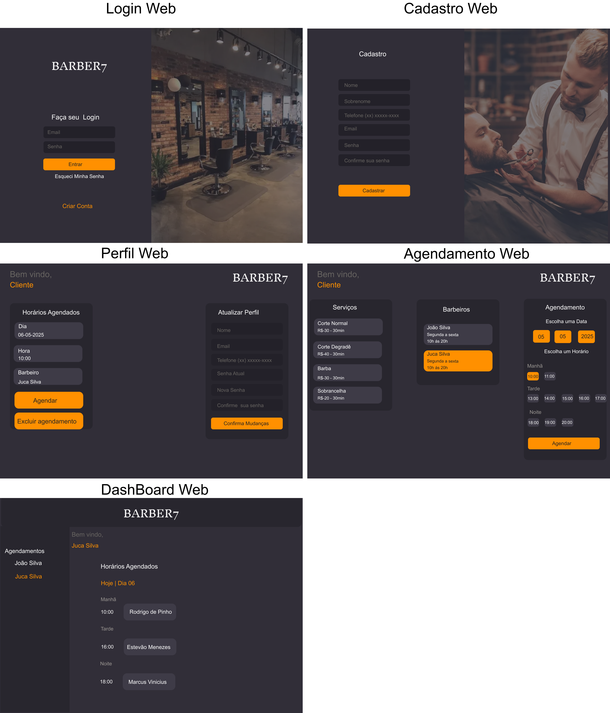
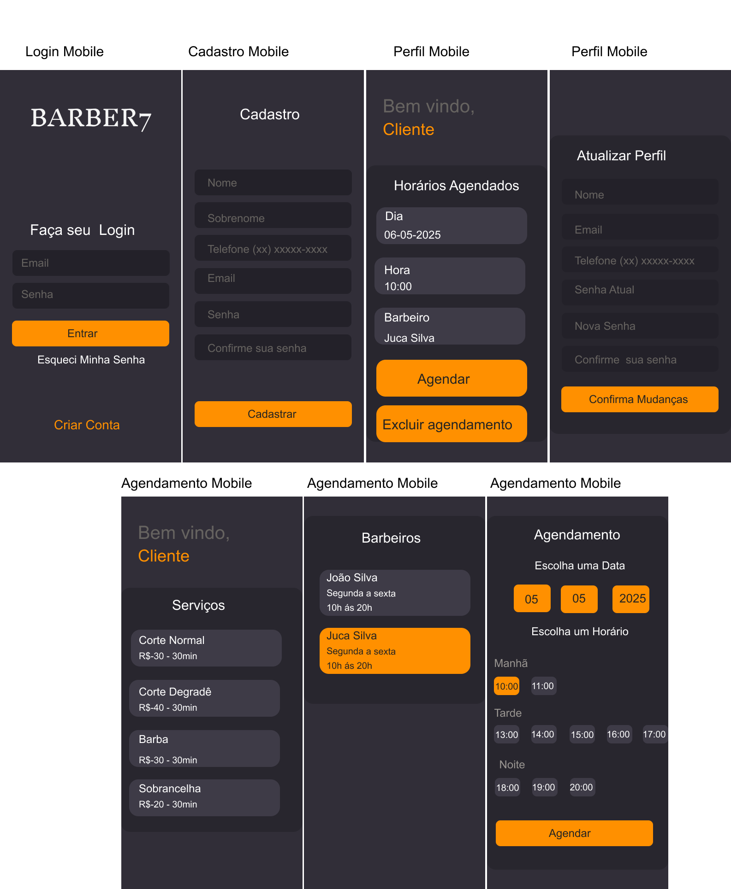

# Projeto Integrador - Desenvolvimento de Sistemas Orientado a Dispositivo Móveis Baseado na Web.

# Plataforma de Agendamento para Barbearias

## 📌 Visão Geral do Projeto

A plataforma digital de agendamento será desenvolvida com o objetivo de otimizar o processo de marcação de horários em barbearias. Pensando na fidelização dos clientes e na gestão eficiente dos serviços, criamos uma solução **exclusiva para cada barbearia**, acessível via QR Code em versão **web e mobile**.

Essa solução permite ao cliente agendar cortes, barbas e outros serviços com autonomia, evitando ligações e filas. Por outro lado, os administradores têm total controle sobre a agenda dos barbeiros, podendo promover horários ociosos e melhorar a comunicação com os clientes.

## 👥 Integrantes do Projeto

- Daniela Kaori Tsuruda
- Estevão Menezes Martin Moraes
- Fernanda Tomita Manchon
- Marcus Vinicius Raduan Boriola
- Rodrigo de Pinho

## Preparação do Ambiente de Desenvolvimento

### 🎨 Layout no Figma
#### WEB

### MOBILE

### 🖥️ Frontend 
- React.js
- Redux
- JavaScript
- HTML5
- CSS3

### 🛠️ Backend 
- Node.js
- Express
- MongoDB (Mongoose)

### Utilitários
- Protótipo – Figma
- Editor -Visual Studio Code
